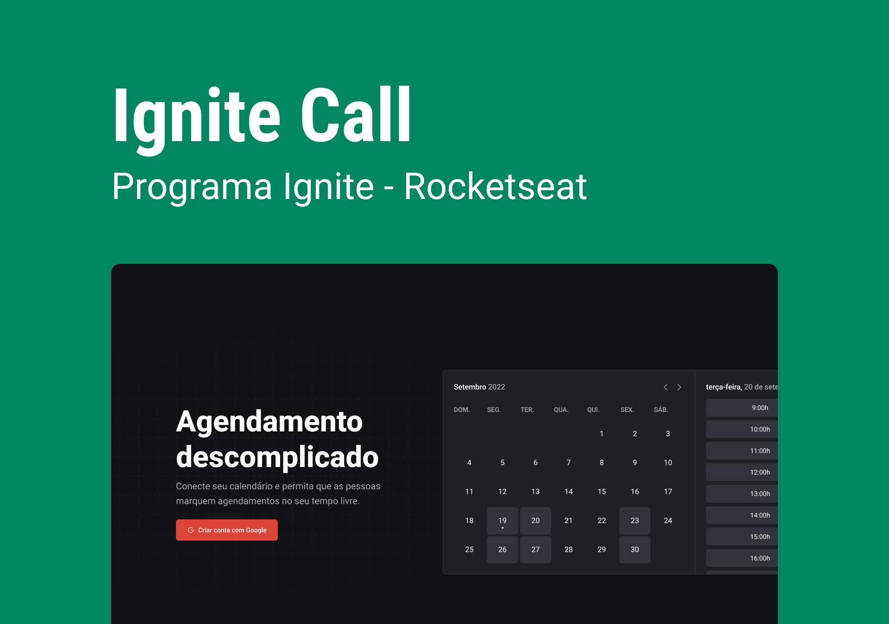
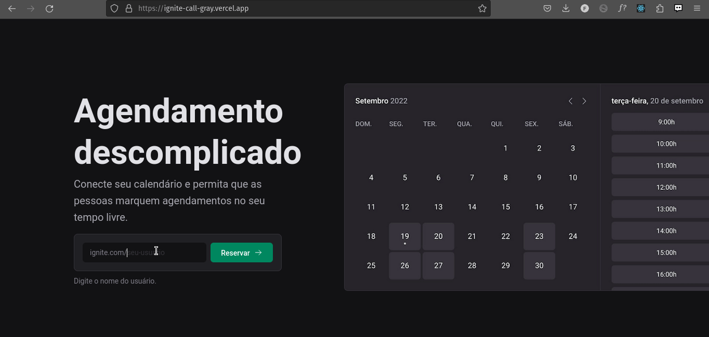

<h1 align="center">
    Ignite Call
</h1>

<h2>📷 Preview </h2>

  <h1 align="center">
    

      
    

  </h1>

Este projeto foi desenvolvido na trilha de React.js com o objetivo de criar uma aplicação que facilite o agendamento de compromissos em horários disponíveis. 
Integrado a API do Google Calendar ,sincronizando seu calendário do Google com  a aplicação.

  ## 🛠 Tecnologias utilizadas:

- [axios](https://www.npmjs.com/package/axios)
- [dayjs](https://www.npmjs.com/package/dayjs)
- [eslint](https://www.npmjs.com/package/eslint)
- [googleapis](https://www.npmjs.com/package/googleapis)
- [next](https://www.npmjs.com/package/next)
- [react-hook-form](https://www.npmjs.com/package/react-hook-form)
- [zod](https://www.npmjs.com/package/zod)
- [prisma](https://www.npmjs.com/package/prisma)

  Feito com 💜 by <a href="https://www.rocketseat.com.br/" >Rocketseat</a>

